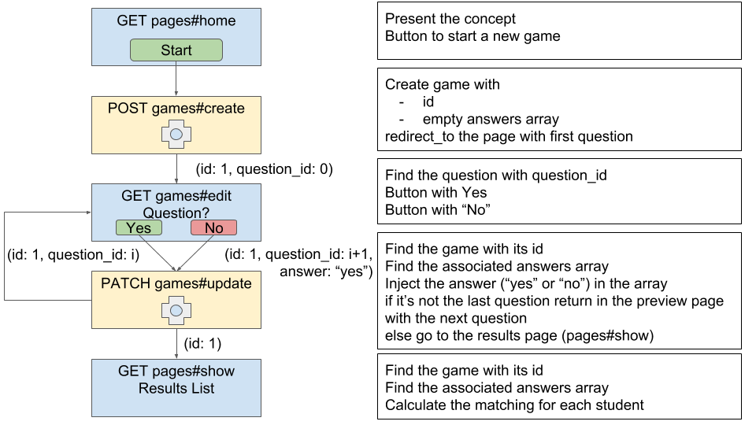

Terminal:
```bash
rails generate controller Games create edit update show
```

Sublime text: /config/routes.rb
```ruby
Rails.application.routes.draw do
  # get 'games/create'
  # get 'games/edit'
  # get 'games/update'
  # get 'games/show'
  # get 'pages/home'
  root to: 'pages#home'
  resources :games
end
```

Terminal:
```bash
rails routes
```

ouput:
```bash
>   Prefix Verb   URI Pattern                Controller#Action
>     root GET    /                          pages#home
>    games GET    /games(.:format)           games#index
>          POST   /games(.:format)           games#create
> new_game GET    /games/new(.:format)       games#new
>edit_game GET    /games/:id/edit(.:format)  games#edit
>     game GET    /games/:id(.:format)       games#show
>         PATCH  /games/:id(.:format)       games#update
>          PUT    /games/:id(.:format)       games#update
>          DELETE /games/:id(.:format)       games#destroy
[...]
```

Sublime text: app/views/pages/home.html.erb
```html
[...]
<%= link_to "commencer", games_path, method: :post, class: "btn btn-success" %>
[...]
```

Sublime text: /app/controllers/games_controller.rb
```ruby
  def create
    # create empty game answers array where we stock answers. ex: ["yes", "no", "no", "yes"]
    redirect_to edit_game_path(id: 1), method: :get # redirect before pass by the create view
  end
```

Sublime text: /app/controllers/games_controller.rb
```ruby
  def edit
    @question = "Does it have clear eyes?"
  end
```

Sublime text: /app/views/games/edit.html.erb
```html
<h1><%= @question %></h1>

<%= link_to "Yes", game_path(id: 1), method: :patch %>
<%= link_to "No", game_path(id: 1), method: :patch %>
```

Sublime text: /app/controllers/games_controller.rb
```ruby
# at the top
  student1 = {
    "name" => "Pauline",
    "answers" => ["yes", "no", "no", "no"]
  }
  student2 = {
    "name" => "Arthur",
    "answers" => ["yes", "no", "no", "yes"]
  }
  STUDENTS = [ student1, student2 ]

  [...]

  def show
    @students = STUDENTS
  end
```

Sublime text: /app/views/games/show.html.erb
```html
<h1>Results</h1>

<ol>
  <% @students.each do |student| %>
    <li><%= student["name"] %> with matching of 3/4</li>
  <% end %>
</ol>
```
