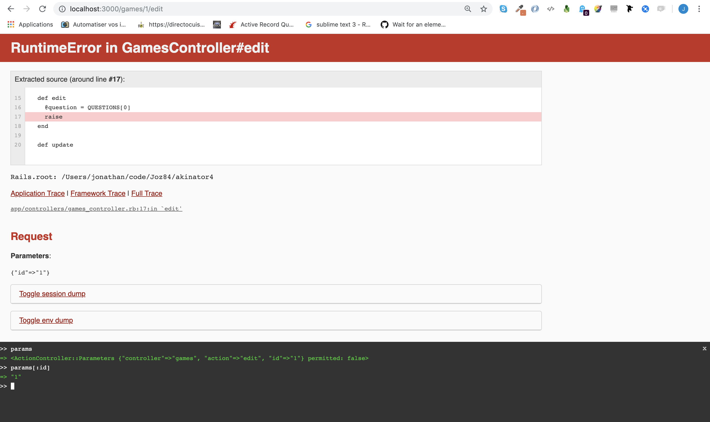
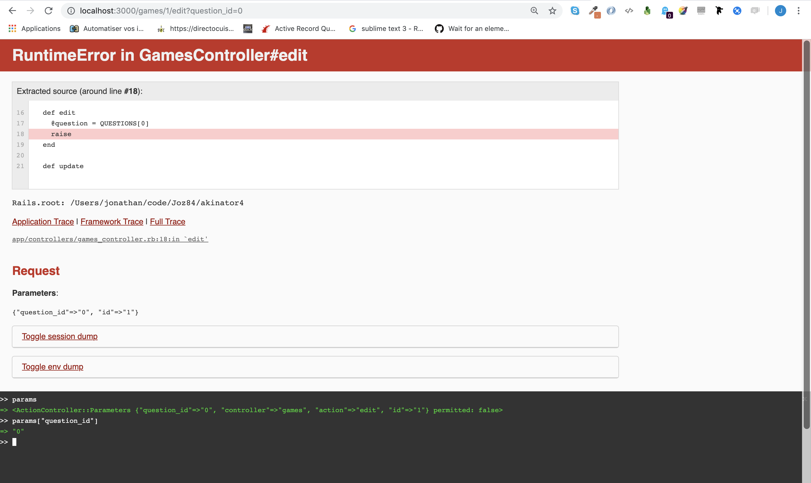
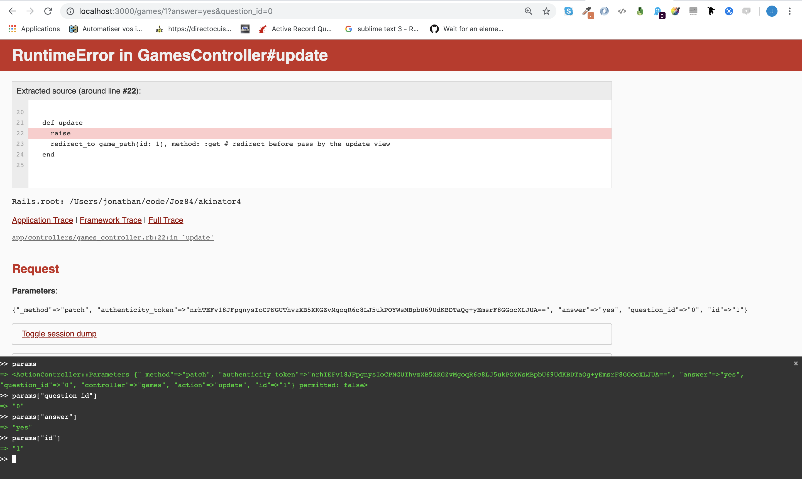

Sublime text: /app/controllers/games_controller.rb
```ruby
  # At the top in capital letter, we can use in all methods
  QUESTIONS = [
   "Does it have clear eyes?",
   "Is this a male?",
   "Is he vegan?",
   "Is he from Aquitaine?"
  ]

  [...]

  def edit
    @question = QUESTIONS[0]
  end
```

Sublime text: /app/controllers/games_controller.rb
```ruby
  def edit
    @question = QUESTIONS[0]
    raise     # stop the program at this line,
              # we can test in the console all variables
              # define in the method like @question
  end
```



Sublime text: /app/controllers/games_controller.rb
```ruby
  def create
    # create game answers array where we stock answers. ex: ["yes", "no", "no", "yes"]
    redirect_to edit_game_path(id: 1, question_id: 0), method: :get
  end
```

Sublime text: /app/controllers/games_controller.rb
```ruby
  def edit
    @question = QUESTIONS[0]
    raise     # stop the program at this line,
              # we can test in the console all variables
              # define in the method like @question
  end
```



Sublime text: /app/controllers/games_controller.rb
```ruby
  def edit
    @question_id = params["question_id"].to_i
    @question = QUESTIONS[@question_id]
  end
```

Sublime text: /app/views/games/edit.html.erb
```html
<h1><%= @question %></h1>

<%= link_to "Yes", game_path(id: 1, question_id: @question_id + 1, answer: "yes"), method: :patch %>
<%= link_to "No", game_path(id: 1, question_id: @question_id + 1, answer: "no"), method: :patch %>
```

Sublime text: /app/controllers/games_controller.rb
```ruby
  def update
    raise
    redirect_to game_path(id: 1), method: :get # redirect before pass by the update view
  end
```



Sublime text: /app/controllers/games_controller.rb
```ruby
  def update
    # stock the answer in game answers array initialized in the create method
    @question_id = params["question_id"].to_i
    if @question_id < QUESTIONS.size
      redirect_to edit_game_path(id: 1, question_id: @question_id), method: :get
    else
      redirect_to game_path(id: 1), method: :get
    end
  end
```
